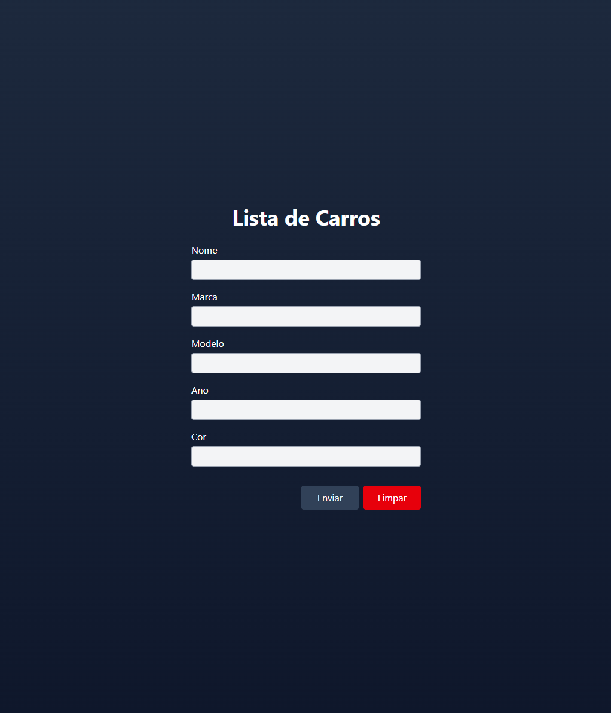

# 🚗 Lista de Carros

Aplicação web para cadastro de veículos com validação de formulário.

Projeto desenvolvido para praticar:

- React
- TypeScript
- React Hook Form
- Zod (validação)
- TailwindCSS

---

## ✨ Funcionalidades

✅ Cadastro de veículo  
✅ Validação de campos obrigatórios  
✅ Reset do formulário  
✅ Cor do veículo definida automaticamente como "vermelha"  
✅ Layout responsivo

---

## 🛠️ Tecnologias

- React
- TypeScript
- React Hook Form
- Zod
- TailwindCSS
- Vite

---

## 📸 Preview



---

## 🚀 Como rodar o projeto

## 🚀 Como rodar o projeto

### 1️⃣ Clonar repositório

```bash
git clone https://github.com/vitorjfa/rpv-form-lista-carros.git
```
